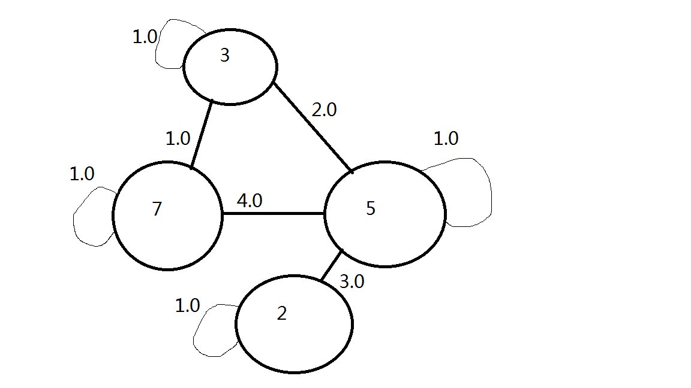

Synchronous-Louvain
===================
Created by Hong Huang
In the code, I built a toy example to verify the correctness of one iteration of the program. The toy example is this:

The numbers inside the circle are vertice id and all the other numbers are edge weights. I have added self loop on purpose to verify the correctness of the program. The weight of selft loop is twice the weight of the community that the current node represents. For instance, you can see that node 
